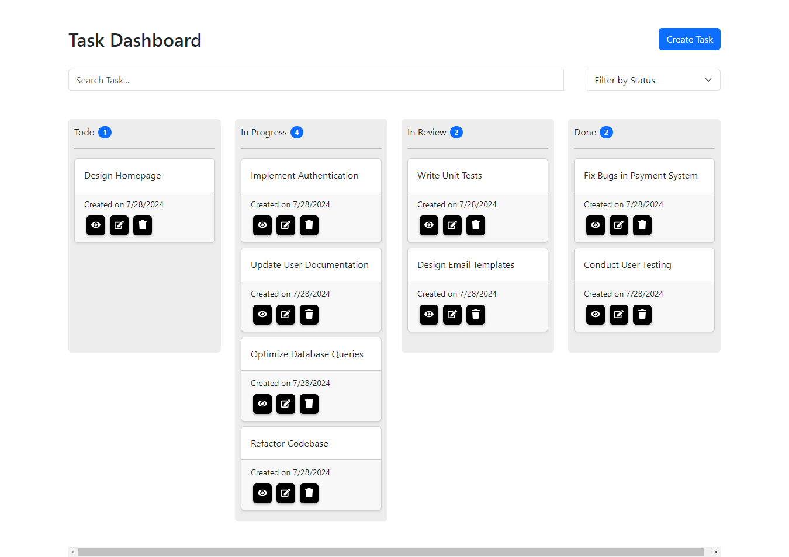

# TaskMaster - Frontend
 
Welcome to the TaskMaster - Frontend repository! This is a React application built with Vite, designed for managing tasks efficiently.

## Installation

To get a local copy up and running follow these simple steps:

### Prerequisites

- Node.js and npm installed on your local machine. You can download Node.js [here](https://nodejs.org/).

### 1. Clone the repository

```bash
git clone https://github.com/muchhalsagar/TaskMaster-Frontend.git
cd TaskMaster-Frontend
```

### 2. Install dependencies

```bash
npm install
```

### 3. Start the development server

```bash
npm run dev
```
The app will be available at http://localhost:3000

